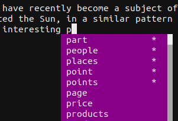

# vim-text-omnicomplete
`vim-text-omnicomplete` is a Vim autocomplete plugin for English words in plain
text files. It provides autocomplete suggestions of English words based on a
word frequency list. To improve the accuracy of suggestions, it also makes
suggestions based on the preceding word.

This plugin automatically sets the omni completion function (`omnifunc`) for
files with the text filetype. As such, when editing text files, you will
be able to use <kbd>Ctrl</kbd><kbd>x</kbd><kbd>Ctrl</kbd><kbd>o</kbd> to show
a list of autocomplete suggestions.




## Requirements
* Python — This plugin requires Python for a build step.
* GNU Make


## Installation
### Installation using Vim's native package management
On Unix-like systems:
```sh
mkdir -p ~/.vim/pack/git-plugins/start/
cd ~/.vim/pack/git-plugins/start/
git clone https://github.com/cwfoo/vim-text-omnicomplete.git
cd vim-text-omnicomplete
make
```

On Windows using the "Git for Windows" Bash terminal:
```sh
mkdir -p ~/vimfiles/pack/git-plugins/start/
cd ~/vimfiles/pack/git-plugins/start/
git clone https://github.com/cwfoo/vim-text-omnicomplete.git
cd vim-text-omnicomplete
make
```

### Installation using vim-plug
You can install this plugin using [vim-plug](https://github.com/junegunn/vim-plug)
by adding the following line to your configuration and running `:PlugInstall`:
```vim
Plug 'cwfoo/vim-text-omnicomplete', { 'do': 'make' }
```


## Documentation
See [doc/vim-text-omnicomplete.txt](doc/vim-text-omnicomplete.txt).


## Development Notes
`autoload/text_omnicomplete_data.vim` is built using the files in the `data/`
directory. Run `make` to rebuild it.


## License
This project is distributed under the BSD 3-Clause License (see LICENSE).
This project uses third-party components that are licensed under their own terms
(see LICENSE-3RD-PARTY).


## Contributing
Bug reports, suggestions, and patches should be submitted on GitHub:
https://github.com/cwfoo/vim-text-omnicomplete
